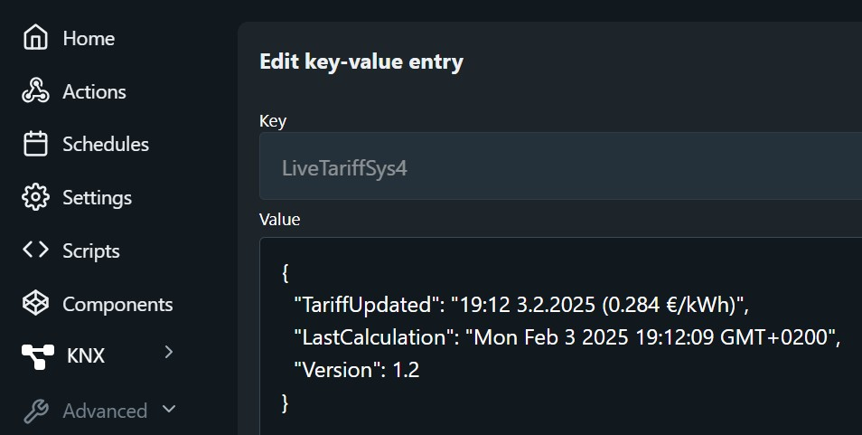

# Shelly Live Tariff Script

> [!TIP]
> This feature allows you to view the exact cost of your electricity usage in Shelly Cloud using Live Tariff if you have any [Shelly power monitoring](https://www.shelly.com/collections/energy-metering) device installed.

- [Shelly Live Tariff Script](#shelly-live-tariff-script)
  - [Features](#features)
  - [Installation](#installation)
    - [New installation](#new-installation)
    - [Configuration using Virtual Components](#configuration-using-virtual-components)
    - [How to force script to KVS mode](#how-to-force-script-to-kvs-mode)
    - [Configuration using KVS](#configuration-using-kvs)
    - [Shelly Live Tariff Configuration](#shelly-live-tariff-configuration)
  - [Usage](#usage)
    - [Device configuration](#device-configuration)
    - [Cost monitoring](#cost-monitoring)
    - [Script Monitoring](#script-monitoring)
  - [License](#license)
  - [Author](#author)


## Features

This Shelly script automates electricity tariffs in the Shelly cloud by retrieving energy market prices from Elering and updating the Live Tariff hourly.

- Retrieves electricity market prices from Elering.
- Updates Shelly cloud with Live Tariffs hourly.
- Supports multiple network packages and countries.
- Stores user settings in Shelly KVS or Virtual components (gen2 Pro or gen3 devices).
- Automatically starts on boot.

## Installation

### New installation

1. Copy the contents of `ShellyLiveTariff.js` to your Shelly device's script editor.
2. Run the script to create KVS or Virtual Components.
3. Configure script settings either in KVS or using Virtual Components.
4. Run the script again. Now everything is fully automatic.

### Configuration using Virtual Components

Shelly Gen2 Pro and Gen3 devices support **Virtual Components**, with all settings managed directly through the Shelly web page or mobile app.  
Please make sure to configure properly Shelly API URL and Network Package, as well as country.

> [!NOTE]
> The script will always update the field **Live Tariff Updated** with the date and time when new tariff was uploaded to Shelly Cloud.


### How to force script to KVS mode

> [!TIP]
> This script can be forced to KVS mode even if Virtal Components are available.  

You want to have this in KVS mode in case you have other important scripts already using Virtual Components in the same device.  
Open the script and set the ManualKVS parameter ``mnKv: true``. Now the script will install in KVS mode.

```js
let c = {
    pack: "VORK2",     // ELEKTRILEVI/IMATRA transmission fee: NONE, VORK1, VORK2, VORK4, VORK5, PARTN24, PARTN24PL, PARTN12, PARTN12PL
    cnty: "ee",        // Estonia-ee, Finland-fi, Lithuania-lt, Latvia-lv
    api: "API_url",    // Shelly Cloud token
    mnKv: false,       // Forcing KVS mode in case of Virtual components support
}
```

### Configuration using KVS

If the script in **KVS mode**, then settings can be modified via the device's web page using its IP address: Menu → Advanced → KVS.  
All the user settings are stored in JSON format under the key ``LiveTariffConf``.
   - `API`: Set your Shelly Cloud token.
   - `EnergyProvider`: Choose the appropriate network package (e.g., `VORK2`, `PARTN24`, etc.).
   - `Country`: Set the country code (e.g., `ee` for Estonia, `fi` for Finland, etc.).


**Supported Network Packages**

The script supports the following network packages from [Elektrilevi](https://elektrilevi.ee/en/vorguleping/vorgupaketid/eramu) and [Imatra](https://imatraelekter.ee/vorguteenus/vorguteenuse-hinnakirjad/):

- `VORK1`
- `VORK2`
- `VORK4`
- `VORK5`
- `PARTN24`
- `PARTN24P`
- `PARTN12`
- `PARTN12P`
- `NONE`

**Supported Countries**

- `ee` (Estonia)
- `fi` (Finland)
- `lv` (Latvia)
- `lt` (Lithuania)

### Shelly Live Tariff Configuration

Configure Shelly cloud to use Live Tariff
1. Open Shelly web portal 
2. Select Energy -> Electricity Tariff
3. Under Tariff select Live
4. Copy API URL and paste it to Live Tariff settings.


## Usage

### Device configuration

There are various ways to configure Shelly devices to ensure the Shelly Cloud energy measurement and cost reports appears accurate and well-organized.

1. Shelly Pro 3EM + Individual Shelly Power Monitoring Devices in the Same Room. <br>
To avoid double-counting energy costs at the room or total account level, devices must be configured properly:
   - Configure Shelly Pro 3EM to include power monitoring in both the room and total account levels.
   - Configure other Shelly monitoring devices in the same room to exclude their data from the total room and total account energy.

|||
|-|-|
|||

1. Shelly Pro 3 EM at Account level + Individual Shelly Power Monitoring Devices in the Different Rooms. <br>
To avoid missing energy costs at the room or double-counting at the total account level, devices must be configured properly:
   - Configure Shelly Pro 3EM to include power monitoring in total account level.
   - Configure other Shelly monitoring devices to include their data fom the total room and exclude from total account energy.

|||
|-|-|
|||

3. Individual Shelly Power Monitoring Devices in the Different Rooms. Account level measurement is missing. <br>
To avoid missing energy costs at the total account level, devices must be configured properly:
   - Configure every Shelly monitoring devices to include power monitoring in both the room and total account levels.
  
### Cost monitoring

There are many ways to explore the electricity usage cost. 

1. **Total Cost.** Open the Shelly Cloud [Total Energy history](https://control.shelly.cloud/#/cons/0) to explore the total cost across your entire energy usage.  


2. **Room Cost.** Open the Shelly Cloud [Total Energy history](https://control.shelly.cloud/#/cons/0) and scroll down to explore the energy cost for any individual room.  


3. **Phase Cost.** This feature is available only if you have a Shelly Pro 3EM. Open the Shelly device consumption page and hover over the graph with your mouse or finger to explore the individual phase and total energy costs passing through the device.   


4. **Device Cost.** Open the consumption page of any power monitoring Shelly device to explore the cost at the device level.   


### Script Monitoring 
- The Virtual Component ``Live Tariff updated`` is updated whenever the tariff is sent to the Shelly Live Tariff cloud.
- Fields ``LastCalculation`` and ``TariffUpdated`` under the ``LiveTariffSys`` in KVS is updated whenever electricity prices are pulled from Elering and the tariff is sent to the Shelly Live Tariff cloud.
- The script will automatically run and update the Shelly Cloud Live Tariffs on an hourly basis.
- To modify user settings, access the Shelly KVS via the Shelly web page: Menu → Advanced → KVS.
- If your Shelly device supports Virtual components, you can modify settings directly from the Shelly web page or Shelly mobile app.



## License

This project is licensed under the MIT License. See the [LICENSE](LICENSE) file for details.

## Author

Created by Leivo Sepp, 07.01.2025

[Shelly Live Tariff - GitHub Repository](https://github.com/LeivoSepp/Shelly-Live-Tariff)