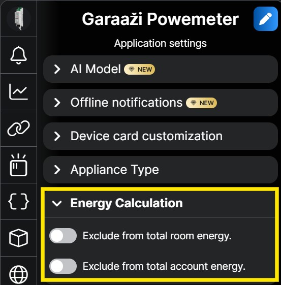
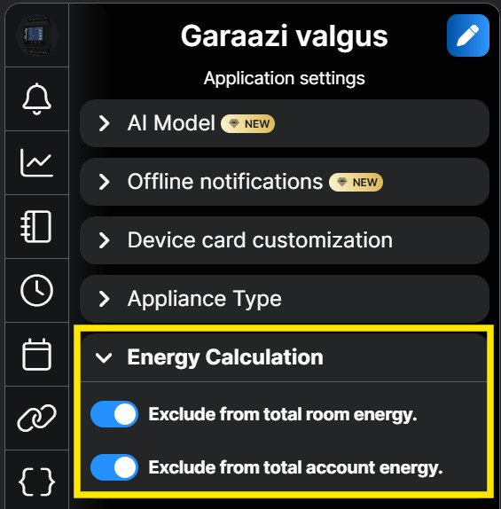
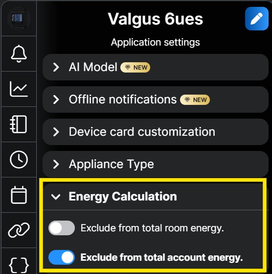
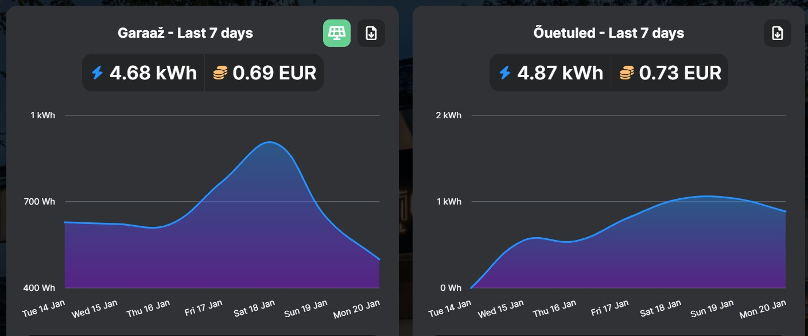
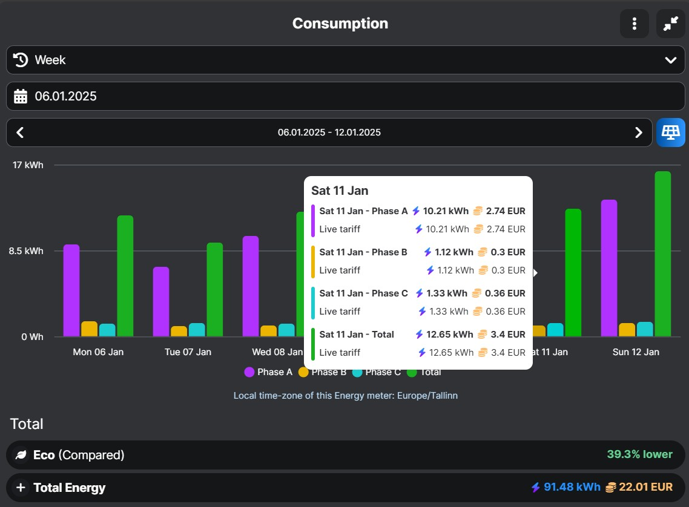
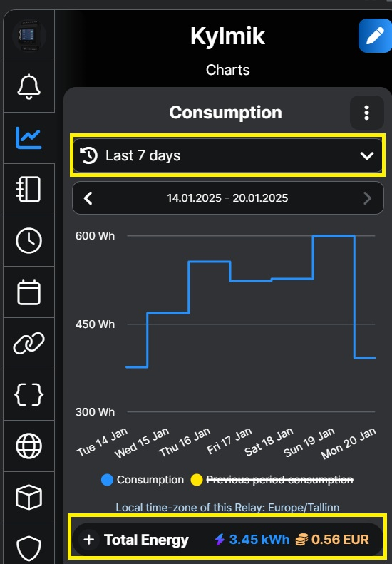

# Shelly Live Tariff Script

This feature allows you to view the exact cost of your electricity usage if you have any [Shelly power monitoring](https://www.shelly.com/collections/energy-metering) device installed.

- [Shelly Live Tariff Script](#shelly-live-tariff-script)
  - [Features](#features)
  - [Installation](#installation)
      - [New installation](#new-installation)
      - [Reinstall](#reinstall)
      - [Script Configuration](#script-configuration)
      - [Live Tariff Configuration](#live-tariff-configuration)
  - [Usage](#usage)
    - [Device configuration](#device-configuration)
    - [Cost monitoring](#cost-monitoring)
    - [Script Monitoring](#script-monitoring)
  - [Network Packages](#network-packages)
  - [Supported Countries](#supported-countries)
  - [License](#license)
  - [Author](#author)

## Features

This Shelly script automates electricity tariffs in the Shelly cloud by retrieving energy market prices from Elering and updating the Live Tariff hourly.

- Retrieves electricity market prices from Elering.
- Updates Shelly cloud with Live Tariffs hourly.
- Supports multiple network packages and countries.
- Stores user settings in Shelly KVS or Virtual components (gen2 Pro or gen3 devices).
- Automatically starts on boot.

## Installation

#### New installation

1. Copy the contents of `ShellyLiveTariff.js` to your Shelly device's script editor.
2. Configure the following settings:
   - `networkPacket`: Choose the appropriate network package (e.g., `VORK2`, `Partner24`, etc.).
   - `country`: Set the country code (e.g., `ee` for Estonia, `fi` for Finland, etc.).
   - `apiUrl`: Set your Shelly Cloud token.

#### Reinstall

To initiate **reinstallation** of the script, navigate to the KVS store and delete the parameter ``version``. After the script starts, it performs a clean installation.

#### Script Configuration 

Shelly Gen2 Pro and Gen3 devices support **Virtual Components**, with all settings managed directly through the Shelly web page or mobile app.

Older Shelly devices (Gen2) support the **KVS store**, and their settings can be modified via the device's web page using its IP address: Menu → Advanced → KVS.

#### Live Tariff Configuration

Configure Shelly cloud to use Live Tariff
1. Open Shelly web portal 
2. Select Energy -> Electricity Tariff
3. Under Tariff select Live
4. Copy API URL and paste it to Live Tariff settings.

## Usage

### Device configuration

There are various ways to configure Shelly devices to ensure the Shelly Cloud energy measurement and cost reports appears accurate and well-organized.

1. Shelly Pro 3EM + Individual Shelly Power Monitoring Devices in the Same Room.  
To avoid double-counting energy costs at the room or total account level, devices must be configured properly:
   - Configure Shelly Pro 3EM to include power monitoring in both the room and total account levels.
   - Configure other Shelly monitoring devices in the same room to exclude their data from the total room and total account energy.

|||
|-|-|
|||

1. Shelly Pro 3 EM at Account level + Individual Shelly Power Monitoring Devices in the Different Rooms.  
To avoid missing energy costs at the room or double-counting at the total account level, devices must be configured properly:
   - Configure Shelly Pro 3EM to include power monitoring in total account level.
   - Configure other Shelly monitoring devices to include their data fom the total room and exclude from total account energy.

|||
|-|-|
|||

3. Individual Shelly Power Monitoring Devices in the Different Rooms. Account level measurement is missing.  
To avoid missing energy costs at the total account level, devices must be configured properly:
   - Configure every Shelly monitoring devices to include power monitoring in both the room and total account levels.
  
### Cost monitoring

There are many ways to explore the electricity usage cost. 

1. **Total Cost.** Open the Shelly Cloud [Total Energy history](https://control.shelly.cloud/#/cons/0) to explore the total cost across your entire energy usage.

2. **Room Cost.** Open the Shelly Cloud [Total Energy history](https://control.shelly.cloud/#/cons/0) and scroll down to explore the energy cost for any individual room.

3. **Phase Cost.** This feature is available only if you have a Shelly Pro 3EM. Open the Shelly device consumption page and hover over the graph with your mouse or finger to explore the individual phase and total energy costs passing through the device. 

4. **Device Cost.** Open the consumption page of any power monitoring Shelly device to explore the cost at the device level. 

### Script Monitoring 
- The field ``Live Tariff updated`` in Virtual Components and KVS is updated whenever the tariff is sent to the Shelly Live Tariff cloud.
- The field ``lastcalculation`` in KVS is updated whenever electricity prices are pulled from Elering.

- The script will automatically run and update the Shelly Cloud Live Tariffs on an hourly basis.
- To modify user settings, access the Shelly KVS via the Shelly web page: Menu → Advanced → KVS.
- If your Shelly device supports Virtual components, you can modify settings directly from the Shelly web page or Shelly mobile app.

## Network Packages

The script supports the following network packages from [Elektrilevi](https://elektrilevi.ee/en/vorguleping/vorgupaketid/eramu) and [Imatra](https://imatraelekter.ee/vorguteenus/vorguteenuse-hinnakirjad/):

- `VORK1`
- `VORK2`
- `VORK4`
- `VORK5`
- `Partner24`
- `Partner24Plus`
- `Partner12`
- `Partner12Plus`
- `NONE`

## Supported Countries

- `ee` (Estonia)
- `fi` (Finland)
- `lv` (Latvia)
- `lt` (Lithuania)

## License

This project is licensed under the MIT License. See the [LICENSE](LICENSE) file for details.

## Author

Created by Leivo Sepp, 07.01.2025

[GitHub Repository](https://github.com/LeivoSepp/Shelly-Live-Tariff)