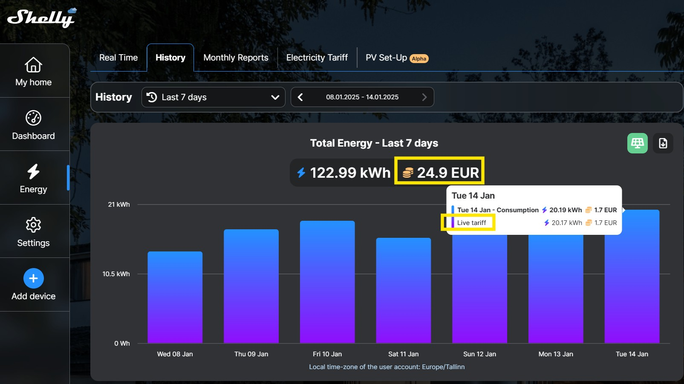
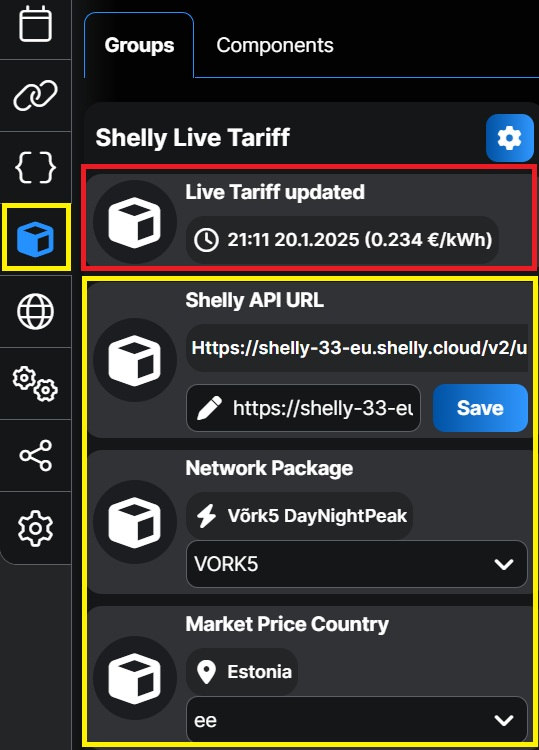
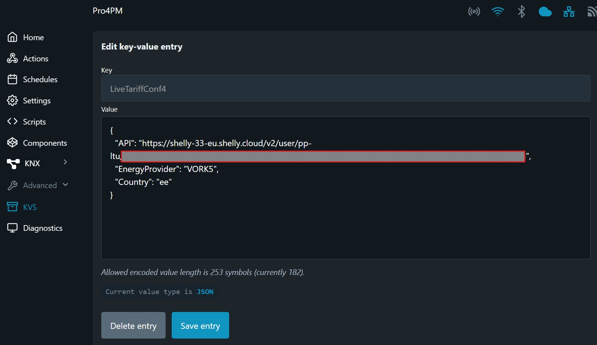
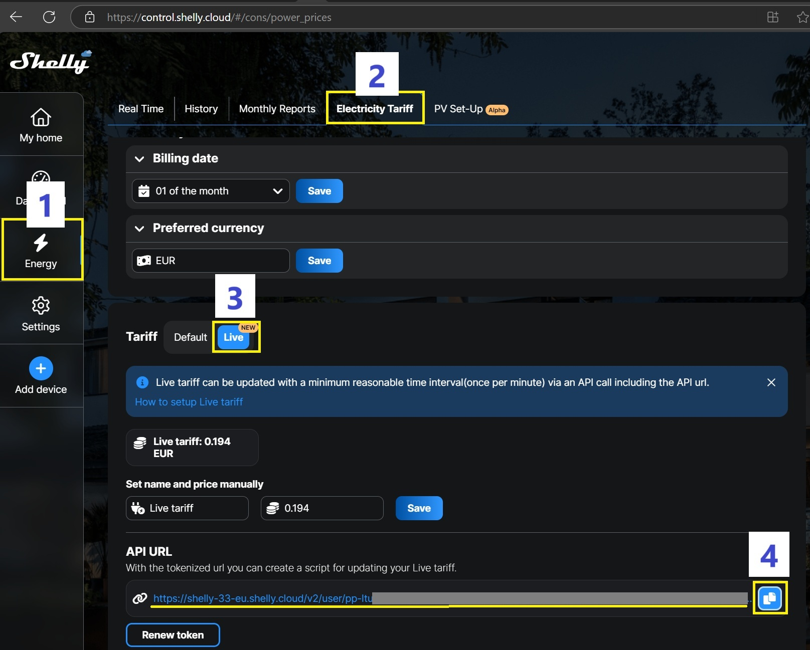

# Shelly Live Tariff Script

This feature allows you to view the exact cost of your entire home's electricity usage if you have a Shelly Pro 3EM installed.

## Features

This Shelly script automates electricity tariffs in the Shelly cloud by retrieving energy market prices from Elering and updating the Live Tariff hourly.

- Retrieves electricity market prices from Elering.
- Updates Shelly cloud with Live Tariffs hourly.
- Supports multiple network packages and countries.
- Stores user settings in Shelly KVS or Virtual components (gen2 Pro or gen3 devices).
- Automatically starts on boot.

## Installation

1. Copy the contents of `ShellyLiveTariff.js` to your Shelly device's script editor.
2. Configure the following settings:
   - `networkPacket`: Choose the appropriate network package (e.g., `VORK2`, `Partner24`, etc.).
   - `country`: Set the country code (e.g., `ee` for Estonia, `fi` for Finland, etc.).
   - `apiUrl`: Set your Shelly Cloud token.

Shelly Gen2 Pro and Gen3 devices support **Virtual Components**, with all settings managed directly through the Shelly web page or mobile app.

Older Shelly devices (Gen2) support the **KVS store**, and their settings can be modified via the device's web page using its IP address: Menu → Advanced → KVS.

3. Configure Shelly cloud to use Live Tariff
   1. Open Shelly web portal
   2. Select Energy -> Electricity Tariff
   3. Under Tariff select Live
   4. Copy API URL and paste it to Live Tariff settings.

## Usage

- The script will automatically run and update the Shelly Cloud Live Tariffs on an hourly basis.
- To modify user settings, access the Shelly KVS via the Shelly web page: Menu → Advanced → KVS.
- If your Shelly device supports Virtual components, you can modify settings directly from the Shelly web page or Shelly mobile app.

## Network Packages

The script supports the following network packages from [Elektrilevi](https://elektrilevi.ee/en/vorguleping/vorgupaketid/eramu) and [Imatra](https://imatraelekter.ee/vorguteenus/vorguteenuse-hinnakirjad/):

- `VORK1`
- `VORK2`
- `VORK4`
- `VORK5`
- `Partner24`
- `Partner24Plus`
- `Partner12`
- `Partner12Plus`
- `NONE`

## Supported Countries

- `ee` (Estonia)
- `fi` (Finland)
- `lv` (Latvia)
- `lt` (Lithuania)

## License

This project is licensed under the MIT License. See the [LICENSE](LICENSE) file for details.

## Author

Created by Leivo Sepp, 07.01.2025

[GitHub Repository](https://github.com/LeivoSepp/Shelly-Live-Tariff)