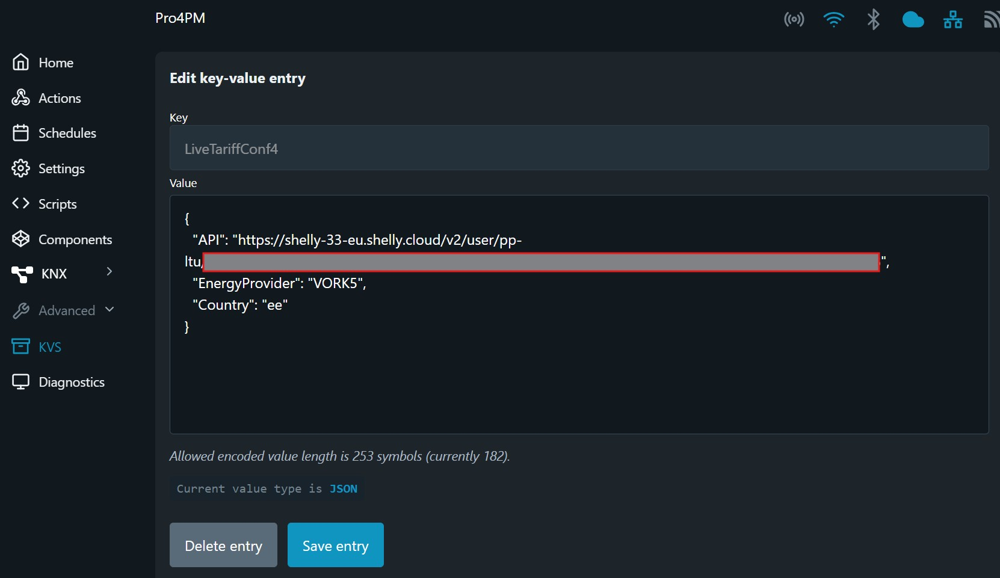

# Shelly Live Tariff Script

Selle skripti abil saate vaadata oma koduse elektritarbimise täpset maksumust Shelly Cloudis kui teil on paigaldatud Shelly Pro 3EM.

- [Shelly Live Tariff Script](#shelly-live-tariff-script)
  - [Omadused](#omadused)
  - [Paigaldamine](#paigaldamine)
      - [Uus paigaldus](#uus-paigaldus)
      - [Uuendamine](#uuendamine)
      - [Skripti häälestamine](#skripti-häälestamine)
      - [Shelly Live Tariff häälestamine](#shelly-live-tariff-häälestamine)
  - [Kasutamine](#kasutamine)
    - [Shelly häälestamine](#shelly-häälestamine)
    - [Rahalise kulu monitoorimine](#rahalise-kulu-monitoorimine)
    - [Skripti monitoorimine](#skripti-monitoorimine)
  - [Võrgupaketid](#võrgupaketid)
  - [Toetatud Riigid](#toetatud-riigid)
  - [Litsents](#litsents)
  - [Autor](#autor)

## Omadused

See Shelly skript automatiseerib elektritariifi Shelly pilves. Elektri börsihinnad laetakse alla Eleringi API kaudu ja Shelly Live Tariff uuendatakse iga tunni järel.

- Börsihindade allalaadimine Eleringi API kaudu.
- Shelly Cloud Live Tariff uuendamine iga tunni järel.
- Toetab Elektrilevi ja Imatra võrgupakette ja nelja riiki.
- Salvestab kasutaja seaded Shelly KVS-i või Virtuaalsetesse komponentidesse (gen2 Pro või gen3 seadmete korral).
- Skript käivitub automaatselt Shelly käivitumisel.

## Paigaldamine

#### Uus paigaldus
1. Kopeerige `ShellyLiveTariff.js` sisu oma Shelly seadme skriptiredaktorisse.
2. Konfigureerige järgmised seaded:
   - `networkPacket`: Valige sobiv võrgupakett (nt `VORK2`, `Partner24` jne).
   - `country`: Määrake riigi kood (nt `ee` Eesti jaoks, `fi` Soome jaoks jne).
   - `apiUrl`: Siia pange oma Shelly Cloud token.

#### Uuendamine

Skripti uuesti installeerimise alustamiseks kustutage KVS-i parameeter ``version``. Pärast skripti käivitamist tehakse puhas paigaldus.

#### Skripti häälestamine

Shelly Gen2 Pro ja Gen3 seadmed toetavad **Virtuaalseid Komponente**, kõiki seadeid saab hallata otse Shelly Cloud veebilehelt või mobiilirakendusest.

Vanemad Shelly seadmed (Gen2) toetavad **KVS keskkonda**, nende seadeid saab muuta seadme veebilehe kaudu, kasutades selle IP-aadressi: Menu → Advanced → KVS.

#### Shelly Live Tariff häälestamine

Konfigureerige Shelly Cloud kasutama Live Tariffi
1. Avage Shelly Cloud keskkond
2. Valige Energy → Electricity Tariff
3. Tariffi all valige Live
4. Kopeerige API URL ja kleepige see skripti Live Tariffi seadistustesse.

## Kasutamine

### Shelly häälestamine

Shelly seadmete seadistamiseks on mitmeid viise, et tagada Shelly Cloudi energiatarbimise kulude aruannete täpsus ja korrastatus.

1. Shelly Pro 3EM + Individuaalsed Shelly energia monitooringu seadmed asuvad samas ruumis.  
Et vältida energiakulude topeltarvestust ruumi või konto tasemel, tuleb seadmed õigesti seadistada:
   - Seadista Shelly Pro 3EM, et see kaasaks energiaseire nii ruumi kui ka konto tasemel.
   - Seadista teised Shelly seadmed samas ruumis nii, et need välistaksid oma andmed ruumi ja konto kogutarbimisest.

2. Shelly Pro 3EM konto tasemel + Individuaalsed Shelly monitooringu seadmed erinevates ruumides.  
Et vältida energiakulu puudumist ruumis või topeltarvestust konto tasemel, tuleb seadmed õigesti seadistada:
   - Seadista Shelly Pro 3EM, et see kaasaks energiaseire konto tasemel.
   - Seadista teised Shelly seadmed, et need kaasaksid andmed ruumi tasemel ja välistaksid need konto kogutarbimisest.

3. Individuaalsed Shelly energia monitooringu seadmed erinevates ruumides, konto taseme mõõtmine puudub.  
Et vältida energiakulude puudumist konto tasemel, tuleb seadmed õigesti seadistada:
   - Seadista iga Shelly seade, et see kaasaks energiaseire nii ruumi kui ka konto tasemel.

### Rahalise kulu monitoorimine

Elektri kulu monitoorimiseks on mitu võimalust.

1. **Kogukulu.** Ava Shelly Cloud [Total Energy history](https://control.shelly.cloud/#/cons/0) ja vaata kui suur on elektri kulu rahas kõikide Shelly seadmete peale kokku.

2. **Ruumi kulu.** Ava Shelly Cloud [Total Energy history](https://control.shelly.cloud/#/cons/0), keri veidi allapoole ja vaata kui suur on iga üksiku ruumi elektrikulu rahas. 

3. **Faasi kulu.** See võimalus on ainult Shelly Pro 3EM omanikel. Ava Shelly elektrikulu vaheleht ja liigu hiire või näpuga üle graafiku, et näha iga iseseisva faasi või ka kogu seadet läbiva elektri rahalist kulu.

4. **Seadme kulu.** Ava mõni energiamõõturiga Shelly seadme  elektrikulu vaheleht ja tutvu selle seadme rahalise kuluga. Nii saad vaadata detailselt näiteks oma külmiku töös hoidmise rahalist kulu. 

### Skripti monitoorimine 
- Väli ``Live Tariff updated`` uuendatakse Virtual Komponentide ja KVS-s sel hetkel kui uus Live Tariff on saadetud Shelly Cloudi.
- Väli ``lastcalculation`` KVS-s kuvab Eleringist börsihindade saamise kuupäeva ja kellaaega.

- Skript töötab automaatselt ja uuendab Shelly Cloud Live Tariffi iga tunni järel.
- Kui teie Shelly seade toetab Virtuaalseid komponente, saate seadeid muuta otse Shelly veebilehelt või Shelly mobiilirakendusest.
- Kasutaja seadete muutmine vanemate Shellyde korral kasutage selle IP-aadressi: Menu → Advanced → KVS.

## Võrgupaketid

Skript toetab järgmisi [Elektrilevi](https://elektrilevi.ee/en/vorguleping/vorgupaketid/eramu) ja [Imatra](https://imatraelekter.ee/vorguteenus/vorguteenuse-hinnakirjad/) võrgupakette:

- `VORK1`
- `VORK2`
- `VORK4`
- `VORK5`
- `Partner24`
- `Partner24Plus`
- `Partner12`
- `Partner12Plus`
- `NONE`

## Toetatud Riigid

- `ee` (Eesti)
- `fi` (Soome)
- `lv` (Läti)
- `lt` (Leedu)

## Litsents

See projekt on litsentseeritud [MIT LICENSE](LICENSE) litsentsi alusel. 

## Autor

Leivo Sepp, 07.01.2025

[GitHub Repository](https://github.com/LeivoSepp/Shelly-Live-Tariff)