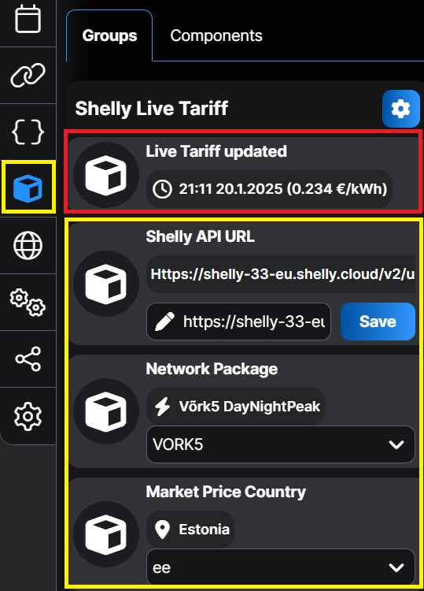

# Shelly Live Tariff Script

Selle skripti abil saate vaadata oma koduse elektritarbimise täpset maksumust Shelly Cloudis kui teil on paigaldatud Shelly Pro 3EM.

## Omadused

See Shelly skript automatiseerib elektritariifi Shelly pilves. Elektri börsihinnad laetakse alla Eleringi API kaudu ja Shelly Live Tariff uuendatakse iga tunni järel.

- Börsihindade allalaadimine Eleringi API kaudu.
- Shelly Cloud Live Tariff uuendamine iga tunni järel.
- Toetab Elektrilevi ja Imatra võrgupakette ja nelja riiki.
- Salvestab kasutaja seaded Shelly KVS-i või Virtuaalsetesse komponentidesse (gen2 Pro või gen3 seadmete korral).
- Skript käivitub automaatselt Shelly käivitumisel.

## Paigaldamine

1. Kopeerige `ShellyLiveTariff.js` sisu oma Shelly seadme skriptiredaktorisse.
2. Konfigureerige järgmised seaded:
   - `networkPacket`: Valige sobiv võrgupakett (nt `VORK2`, `Partner24` jne).
   - `country`: Määrake riigi kood (nt `ee` Eesti jaoks, `fi` Soome jaoks jne).
   - `apiUrl`: Siia pange oma Shelly Cloud token.

Shelly Gen2 Pro ja Gen3 seadmed toetavad **Virtuaalseid Komponente**, kõiki seadeid saab hallata otse Shelly Cloud veebilehelt või mobiilirakendusest.

Vanemad Shelly seadmed (Gen2) toetavad **KVS keskkonda**, nende seadeid saab muuta seadme veebilehe kaudu, kasutades selle IP-aadressi: Menu → Advanced → KVS.

1. Konfigureerige Shelly Cloud kasutama Live Tariffi
   1. Avage Shelly Cloud keskkond
   2. Valige Energy → Electricity Tariff
   3. Tariffi all valige Live
   4. Kopeerige API URL ja kleepige see skripti Live Tariffi seadistustesse.

## Kasutamine

- Skript töötab automaatselt ja uuendab Shelly Cloud Live Tariffi iga tunni järel.
- Kui teie Shelly seade toetab Virtuaalseid komponente, saate seadeid muuta otse Shelly veebilehelt või Shelly mobiilirakendusest.
- Kasutaja seadete muutmine vanemate Shellyde korral kasutage selle IP-aadressi: Menu → Advanced → KVS.

## Võrgupaketid

Skript toetab järgmisi [Elektrilevi](https://elektrilevi.ee/en/vorguleping/vorgupaketid/eramu) ja [Imatra](https://imatraelekter.ee/vorguteenus/vorguteenuse-hinnakirjad/) võrgupakette:

- `VORK1`
- `VORK2`
- `VORK4`
- `VORK5`
- `Partner24`
- `Partner24Plus`
- `Partner12`
- `Partner12Plus`
- `NONE`

## Toetatud Riigid

- `ee` (Eesti)
- `fi` (Soome)
- `lv` (Läti)
- `lt` (Leedu)

## Litsents

See projekt on litsentseeritud [MIT LICENSE](LICENSE) litsentsi alusel. 

## Autor

Leivo Sepp, 07.01.2025

[GitHub Repository](https://github.com/LeivoSepp/Shelly-Live-Tariff)